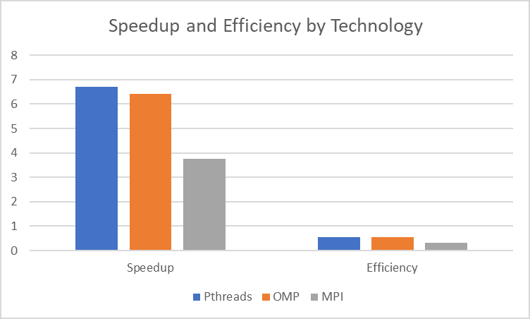
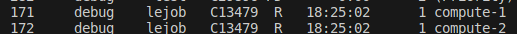

## Quick  Links

[OMP Readme](zippass_omp/design/README.md)

[MPI Readme](zippass_mpi/design/README.md)

--------------------- 
 In this report we see and analyze the results gotten in this homework

 ## OMP - Pthread Comparison

 

In this chart there is a clear trend where OMP is less productive as well as less efficient than it's pthread counterpart. This can be attributed to the inefficiencies that can be found in "plug-n-play" libraries. Which most times offer ease of programming by sacrificing efficiency.

 ## Comparacion MPI - OMP - Pthread

 

 In this case it can be seen that MPI has the worst performance among all technologies. In this case, this happened since the MPI tests had to be run in the local machine instead of the Poas Cluster. The reason is the following: 

 **There was an issue when testing in the Poas Cluster. When the jobs were sent to the queue a job was running, and at the time of writing this report the run time of that job is more than 18 hours. Given this condition, the MPI cases were not able to be tested in a distributed environment. This resuts reflect the runs performed in the same machine as the other tests (local machine)**

### Job stuck in the cluster queue

We can assume that if these tests would be ran in the Poas cluster we would be able to achieve a greater speedup or at least equivalent. Also if the algorithm was made differently, not dividing the files amongst the nodes, but rather the passwords, this could prove very interesting, but given the complexity of that implementation, it was out of scope of the proof of concept homework. 