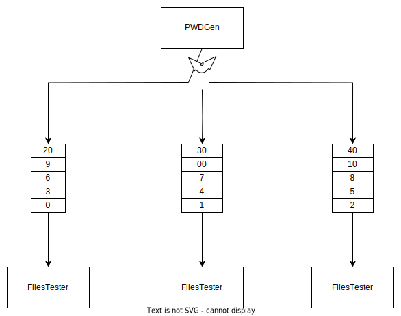

# ZIPPass_Pthread Design

For more information about the system: [MainReadme](../README.md)

## Overview of the system
In the case of the design of this system, the approach detailed in the UML chart was chosen thinking in both scalability and maintainibility. The system is divided in the following way: 
* 7 subroutine modules
* 5 data structures

In the case of the subroutine modules they are divided in the following way: 
1. **Zippass_pthread**: This module is dedicated to receiving the input data and the amount of threads to run and printing out the result of each decrypted file.
2. **Choice_selection**: This module contains the basic calls to both serial and parallel algorithms to choose from.
3. **Password_logic**: This module is dedicated to generating new passwords and inputting them into the zip_operations module.
4. **Input_reader**: This module is dedicated to processing and validating the information inputted by the user.
5. **Zip_operations**: This module tests a generated password against the file that wants to be decrypted.
6. **Queue_Manager**: This module contains all the operations related to each file tester queue.
7. **Thread_Manager**: This module contains the logic behind the Password Generator and File Tester threads .

In the case of the data structures they are divided in the following way: 
1. publicData: Data that is shared and common among all the threads
2. FilesData: Data containing the file path, the found password and a boolean flag for each file inputted.
3. QueueData: Data that is proper to each testerThread queue like size, and the queue itself.
4. testerThreadData: Data that is owned exclusively by the testerThreads like threadNumber, it's queue.
5. pwdGenData: Data that is owned exclusively by the passwordGenerator like all queues and thread number.

------------
## Flow of the design
To understand better how the system works, a flowchart with sample data is provided. It details the whole decision process and data flow of the system. It can be summarized in the following way:
1. Data is inputted into our `main()` function
2. This data is validated to be composed of only ASCII characters. If not, go back to main
3. The system determines the lines and number of lines in the input
4. The lines are saved in an array of lines
5. These lines' format is validated for a series of tests
6. If the data is valid the different data structures are iniialized based on the data input
7. The PwdGenData, testerThreadData and numOfThreads are passed onto the `create_threads` function
8. `create_threads` generates one thread for the Password Generator and the remaining threads are assigned to the File Testers.
9. In parallel the threads will work in the following way:
    * ***The Password Generator Thread*** will start generating passwords and cycle through the testerThread queues, enqueueing a single password in each iteration. Once all passwords have been generated it will enqueue a void string indicating that all passwords have been generated and in that way signaling the end of the queue.
    * ***The File Tester Threads*** will dequeue a value from their own queue and test it in all files serially, this way testing a lot of passwords at the same time. Once a password is found for a file, a boolean flag is changed to `true` ,indicating that the password was deciphered for that file, and the password will be logged inside the file data structure. Once all files have been deciphered or all passwords have been tested it will return a success value.
10. Once all iterations are done, or all passwords are deciphewred this will trigger the print of the file paths and their passwords, in the same order they were inputted.

  

--------------------------
## Memory Diagram

In order to understand the program better the memory diagram was created for this system for a test case of 3 threads.

-------------------------------------

## Improvement over Serial Algorithm

As part of the testing, the time taken by both the serial algorithm and the parallel one were taken. This tests were run in an Ubuntu virtual machine with a 12 CPUs, Core i9-11900k with 24 GB DDR4 3200 MHz RAM memory and a Hard Drive XPG Gammix S50 Lite with a read speed of 3900 MB/s and  write speed of 3200 MB/s. 

As can be seen past 8 cores it's were the algorithm starts to become less efficient very fast. A deeper testing must be done to determine the exact point where this algorithm start to bottleneck. Given the results, we will ignore the case were the algorithm takes less than a second and will be treated as a different problem altogether. The speedup seems to be assymptotic to around 8 or 9, so the top efficiency is going to be around that amount of threads. Here a graph is presented showing the results of the comparison between threads and speedup and efficiency. After that, the tables with the detailed results is presented.

### Summary of the results

### Results with 24 threads
|Test Case|~Serial(s)|~Parallel 12 threads(s)|Speedup|Efficiency|
|---------|----------|-----------------------|-------|----------|
| **000** |   72.9   |          10.2         |  7.15 |   0.30   |
| **001** |   56.5   |           8.2         |  6.89 |   0.29   |
| **002** |  101.2   |          14.6         |  6.93 |   0.29   |
| **003** |  131.4   |          19.4         |  6.77 |   0.28   |
| **004** |   0.43   |          0.66         |  0.65 |   0.03   |
| **005** |  173.8   |          17.7         |  9.82 |   0.41   |
| **006** | 1171.4   |         159.0         |  7.36 |   0.31   |
| **007** | 5530.8   |         810.0         |  6.83 |   0.38   |
|         |          |        **AVG**        |**7.39**|**0.32** |

### Results with 12 threads
|Test Case|~Serial(s)|~Parallel 12 threads(s)|Speedup|Efficiency|
|---------|----------|-----------------------|-------|----------|
| **000** |   72.9   |          10.5         |  6.94 |   0.58   |
| **001** |   56.5   |           8.2         |  6.89 |   0.57   |
| **002** |  101.2   |          14.8         |  6.83 |   0.56   |
| **003** |  131.4   |          21.0         |  6.25 |   0.52   |
| **004** |   0.43   |          0.68         |  0.63 |   0.05   |
| **005** |  173.8   |          27.9         |  6.22 |   0.52   |
| **006** | 1171.4   |         159.5         |  7.34 |   0.61   |
| **007** | 5530.8   |         849.3         |  6.51 |   0.54   |
|         |          |        **AVG**        |**6.71**|**0.48** |

### Results with 8 threads
|Test Case|~Serial(s)|~Parallel 8 threads(s)|Speedup|Efficiency|
|---------|----------|----------------------|-------|----------|
| **000** |   72.9   |          11.6        |  6.28 |   0.79   |
| **001** |   56.5   |           9.5        |  5.95 |   0.74   |
| **002** |  101.2   |          17.0        |  5.95 |   0.74   |
| **003** |  131.4   |          22.4        |  5.87 |   0.73   |
| **004** |   0.43   |          0.61        |  0.70 |   0.09   |
| **005** |  173.8   |          30.1        |  5.77 |   0.72   |
| **006** | 1171.4   |         183.6        |  6.38 |   0.80   |
| **007** | 5530.8   |         933.0        |  5.93 |   0.74   |
|         |          |        **AVG**       |**6.01**|**0.75** |

### Results with 4 threads
|Test Case|~Serial(s)|~Parallel 4 threads(s)|Speedup|Efficiency|
|---------|----------|----------------------|-------|----------|
| **000** |   72.9   |          24.3        |  3.00 |   0.75   |
| **001** |   56.5   |          20.2        |  2.80 |   0.70   |
| **002** |  101.2   |          34.8        |  2.91 |   0.73   |
| **003** |  131.4   |          46.0        |  2.86 |   0.72   |
| **004** |   0.43   |          0.61        |  0.70 |   0.18   |
| **005** |  173.8   |          61.6        |  2.82 |   0.71   |
| **006** | 1171.4   |         362.3        |  3.23 |   0.81   |
| **007** | 5530.8   |        1943.4        |  2.85 |   0.71   |
|         |          |        **AVG**       |**2.92**|**0.73** |