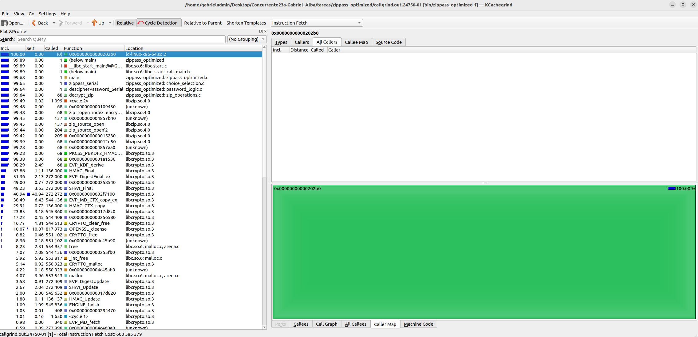
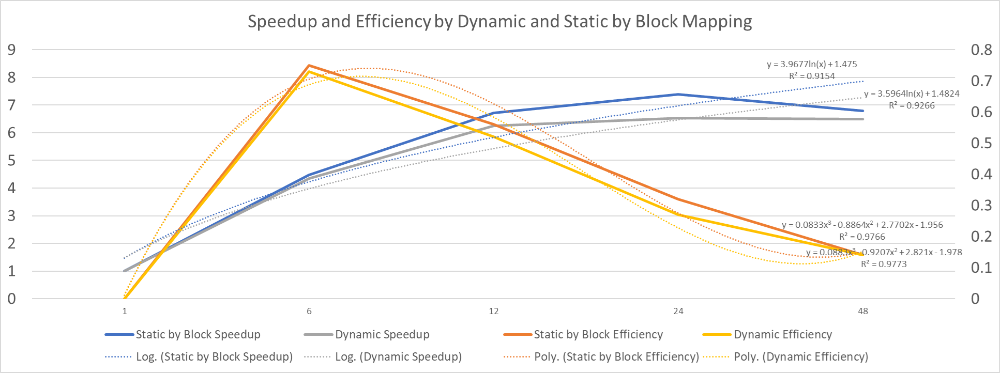

# ZIPPass_Pthread Report

For more information about the system: [MainReadme](../README.md)

## Improvement over Serial Algorithm

As part of the testing, the time taken by both the serial algorithm and the parallel one were taken. This tests were run in an Ubuntu virtual machine with a 12 CPUs, Core i9-11900k with 24 GB DDR4 3200 MHz RAM memory and a Hard Drive XPG Gammix S50 Lite with a read speed of 3900 MB/s and  write speed of 3200 MB/s. 

As can be seen past 8 cores it's were the algorithm starts to become less efficient very fast. A deeper testing must be done to determine the exact point where this algorithm start to bottleneck. Given the results, we will ignore the case were the algorithm takes less than a second and will be treated as a different problem altogether. The speedup seems to be assymptotic to around 8 or 9, so the top efficiency is going to be around that amount of threads. Here a graph is presented showing the results of the comparison between threads and speedup and efficiency. After that, the tables with the detailed results is presented.

### Serial Optimization
In the case of the serial algorithm this one wasn't able to be optimized as 99.48% of the execution time is concentrated in the `zip_fopen_index_encrypted` call. Since this is part of the zip library, there isn't an optimization to do to this that wouldn't require a complete refactor of the code.

-------------------------------------------------------------------------------------------

------------------------------------------------------
### Summary of the results

### Results with 48 threads
|Test Case|~Serial(s)|~~Static by Block 48 threads(s)|~Dynamic 48 threads(s)|Speedup SB|Efficiency SB|Speedup D|Efficiency D|
|---------|----------|-------------------------------|----------------------|----------|-------------|---------|------------|
| **000** |   72.9   |             10.67             |        11.42         |   6.83   |    0.14     |   6.38  |    0.13    |
| **001** |   56.5   |             8.31              |        9.26          |   6.80   |    0.14     |   6.10  |    0.13    |
| **002** |  101.2   |             14.61             |        15.46         |   6.93   |    0.14     |   6.55  |    0.14    |
| **003** |  131.4   |             20.05             |        20.48         |   6.55   |    0.14     |   6.42  |    0.13    |
| **004** |   0.43   |             0.63              |        0.95          |   0.68   |    0.01     |   0.45  |    0.01    |
| **005** |  173.8   |             25.92             |        26.19         |   6.71   |    0.14     |   6.63  |    0.14    |
| **006** | 1171.4   |             163.89            |        168.13        |   7.15   |    0.15     |   6.96  |    0.15    |
| **007** | 5530.8   |             835.96            |        869.76        |   6.62   |    0,14     |   6.36  |    0.13    |
|         |          |                               |        **AVG**       | **6.80** |  **0.14**   | **6.49**|  **0.14**  |

### Results with 24 threads
|Test Case|~Serial(s)|~Static by Block 24 threads(s)|~Dynamic 24 threads(s)|Speedup SB|Efficiency SB|Speedup D|Efficiency D|
|---------|----------|------------------------------|----------------------|----------|-------------|---------|------------|
| **000** |   72.9   |          10.2                |        11.86         |     7.15 |   0.30      |   6.15  |    0.25    |
| **001** |   56.5   |           8.2                |        8.59          |     6.89 |   0.29      |   6.58  |    0.27    |
| **002** |  101.2   |          14.6                |        15.18         |     6.93 |   0.29      |   6.67  |    0.28    |
| **003** |  131.4   |          19.4                |        21.14         |     6.77 |   0.28      |   6.22  |    0.26    |
| **004** |   0.43   |          0.66                |        0.64          |     0.65 |   0.03      |   0.67  |    0.03    |
| **005** |  173.8   |          17.7                |        25.53         |     9.82 |   0.41      |   6.81  |    0.28    |
| **006** | 1171.4   |         159.0                |        168.73        |     7.36 |   0.31      |   6.94  |    0.29    |
| **007** | 5530.8   |         810.0                |        858.59        |     6.83 |   0.38      |   6.44  |    0.27    |
|         |          |                              |       **AVG**        |  **7.39**| **0.32**    | **6.54**|  **0.27**  |

### Results with 12 threads
|Test Case|~Serial(s)|~Static by Block 12 threads(s)|~Dynamic 12 threads(s)|Speedup SB|Efficiency SB|Speedup D|Efficiency D|
|---------|----------|------------------------------|----------------------|----------|-------------|---------|------------|
| **000** |   72.9   |          10.5                |         11.4         |  6.94    |   0.58      |  6.39   |    0.53    |
| **001** |   56.5   |           8.2                |         8.88         |  6.89    |   0.57      |  6.36   |    0.53    |
| **002** |  101.2   |          14.8                |         16.35        |  6.83    |   0.56      |  6.19   |    0.52    |
| **003** |  131.4   |          21.0                |         21.9         |  6.25    |   0.52      |  6.00   |    0.50    |
| **004** |   0.43   |          0.68                |         0.67         |  0.63    |   0.05      |  0.64   |    0.05    |
| **005** |  173.8   |          27.9                |         30.32        |  6.22    |   0.52      |  5.67   |    0.47    |
| **006** | 1171.4   |         159.5                |         173.59       |  7.34    |   0.61      |  6.75   |    0.56    |
| **007** | 5530.8   |         849.3                |         863.25       |  6.51    |   0.54      |  6.41   |    0.53    |
|         |          |                              |         **AVG**      |**6.71**  | **0.56**    |**6.25** |  **0.52**  |

### Results with 6 threads
|Test Case|~Serial(s)|~Static by Block 6 threads(s)|~Dynamic 6 threads(s)|Speedup SB|Efficiency SB|Speedup D|Efficiency D|
|---------|----------|-----------------------------|---------------------|----------|-------------|---------|------------|
| **000** |   72.9   |          17.44              |        16.52        |   4.18   |    0.70     |   4.41  |    0.74    |
| **001** |   56.5   |          12.31              |        13.07        |   4.59   |    0.77     |   4.32  |    0.72    |
| **002** |  101.2   |          22.15              |        22.99        |   4.57   |    0.76     |   4.40  |    0.73    |
| **003** |  131.4   |          29.68              |        30.37        |   4.43   |    0.74     |   4.33  |    0.72    |
| **004** |   0.43   |          0.64               |        0.63         |   0.67   |    0.11     |   0.68  |    0.11    |
| **005** |  173.8   |          39.28              |        40.52        |   4.42   |    0.74     |   4.29  |    0.72    |
| **006** | 1171.4   |          244.87             |        262.05       |   4.78   |    0.80     |   4.47  |    0.75    |
| **007** | 5530.8   |          1288.31            |        1302.84      |   4.29   |    0.72     |   4.25  |    0.71    |
|         |          |                             |       **AVG**       | **4.47** |  **0.75**   | **4.35**|  **0.73**  |
  

## Grado de concurrencia

As seen in the graph above the speedup seems to stop increasing around 12-15 threads, which makes it so the actual execution time is not getting better after this. On the efficiency side we can see that it peaks around 8 threads, which means that in order to get the best ratio between amount of threads and speedup. Apart from this we can see that the static by block mapping is more efficient in this case, given that this mapping doesn't need as much concurrency controls and hence it can parallelize more of the execution, where the dynamic mapping can only parallelize so much when every queue operation needs to be controlled.